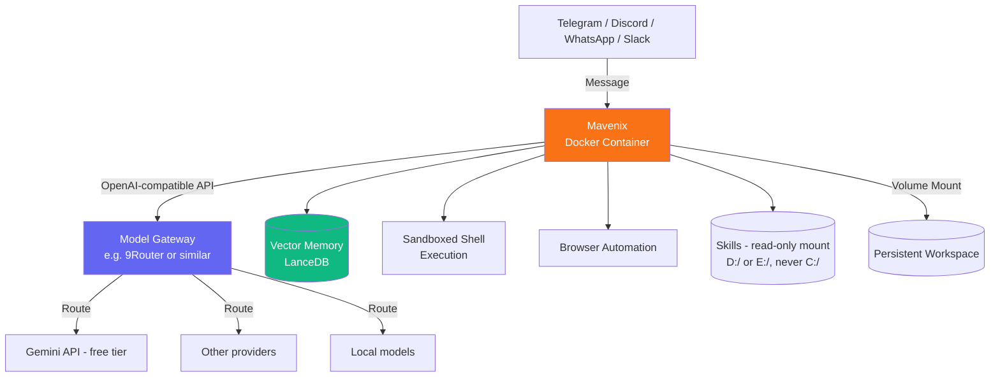

<div align="center">

# ⚙️ Mavenix

### Self-Hosted Agentic AI for Operations & Workflow Automation

<br>


</div>

---

## 📋 What is Mavenix?

**Mavenix** is a self-hosted, agentic AI system specialized in **operations, workflow automation, and cross-system execution** — built on [OpenClaw](https://github.com/openclaw/openclaw) and connected to any OpenAI-compatible model gateway of your choice.

Unlike general-purpose chatbots, Mavenix is scoped to a single discipline: turning plans into **reliable, repeatable, measurable operations**. It automates workflows, orchestrates multi-step processes, integrates systems, and monitors execution — reachable from Telegram, Discord, WhatsApp, or Slack.

### 🎯 Specialization

| Area | What It Does |
|---|---|
| **Workflow Automation** | Designs and implements automated workflows for repetitive tasks |
| **Process Orchestration** | Coordinates multi-step operations across systems |
| **System Integration** | Connects APIs, services, and platforms into unified pipelines |
| **Operational Monitoring** | Tracks workflow health, detects failures, reports performance |
| **Browser & Computer Automation** | Executes browser-based and desktop automation tasks |

---

## 🔌 What It Can Connect To

| Category | Options |
|---|---|
| **Messaging** | Telegram, Discord, WhatsApp, Slack — configure one or several |
| **Model Providers** | Any OpenAI-compatible endpoint: OpenAI, Anthropic (via proxy), Google Gemini, Groq, DeepSeek, local models (Ollama, vLLM, llama.cpp), or a routing layer |
| **Search** | DuckDuckGo (free, no key), Brave Search, Exa, Tavily, SearXNG (self-hosted) |
| **Automation** | Browser control (Chrome), Computer Use, Google Meet integration |
| **Memory** | Vector-based persistent memory (LanceDB) with auto-capture and auto-recall |
| **Skills** | Community skills via [skills.sh](https://skills.sh) — see [Skills Setup](#-skills-setup) below |

---

## ♾️ "Unlimited" Model Access via a Routing Layer

Mavenix doesn't lock you into one paid API. Instead of hardcoding a single provider, point `MODEL_GATEWAY_BASE_URL` at a **routing layer** (such as [9Router](https://github.com) or similar OpenAI-compatible gateways) that sits between Mavenix and your actual model providers.

This unlocks a few practical things:

- **Combo/fallback chains** — configure a primary model with automatic fallbacks (e.g., a fast model first, a stronger one if it fails or rate-limits), so the agent keeps working even if one provider hiccups
- **Mix free and paid tiers** — route through generous free tiers (Google Gemini API's free tier, Groq's free tier, etc.) alongside paid ones, letting the router pick based on availability or cost
- **Provider-agnostic** — swap providers later without touching Mavenix's code, since it only ever talks to your router's single OpenAI-compatible endpoint

**Example:** many people configure a free-tier **Gemini API key** as one node in their router's combo, alongside other free or low-cost providers, to substantially extend how much usage they get before hitting a paywall. This is a router-level decision — Mavenix itself just calls whatever `MODEL_GATEWAY_BASE_URL` you give it. Check your router's own documentation for how to configure combos and fallback chains; this repository doesn't manage that logic itself.

---

## 🧩 Skills Setup

Mavenix can use community-built [Agent Skills](https://skills.sh) — reusable capabilities like SEO audits, PDF processing, data analysis, and more, maintained by an open registry (originally curated by Vercel Labs and community contributors).

### Installing Skills

Skills are installed via `npx` from inside the container (or from the host if you mount a shared skills directory — see below):

```bash
# Search for a skill
npx skills find "browser testing"

# Install a specific skill
npx skills add browserbase/skills/browser

# List installed skills
npx skills list
```

### Recommended Starter Skills (10–15)

A reasonable starting set for an operations-focused agent:

```bash
npx skills add vercel-labs/skills/frontend-design
npx skills add browserbase/skills/browser
npx skills add anthropics/skills/pdf
npx skills add anthropics/skills/docx
npx skills add anthropics/skills/xlsx
npx skills add anthropics/skills/pptx
npx skills add anthropics/skills/systematic-debugging
npx skills add anthropics/skills/test-driven-development
npx skills add community/skills/seo-audit
npx skills add community/skills/web-scraping
npx skills add community/skills/data-analysis
npx skills add community/skills/github-pr-workflow
```

> ⚠️ Verify exact package names on [skills.sh](https://skills.sh) before installing — the registry is community-maintained and names/availability change. Search first with `npx skills find` rather than assuming a name exists.

### Reading Skills From Other Agents (Claude, OpenCode, Vercel, etc.) — Without Touching `C:\`

If you already have skills installed for other tools (Claude, OpenCode, Vercel CLI, etc.) sitting somewhere like `C:\Users\<you>\.agents\skills`, Mavenix can **read** them too — without ever mounting or modifying your `C:` drive.

The approach: **copy or symlink the skills folder to `D:\` or `E:\` first**, then mount only that copy into the container as **read-only**. This keeps your system drive completely untouched while still giving the agent access.

**Windows (PowerShell) — one-time copy:**
```powershell
# Copy your existing skills folder to a drive you're comfortable mounting
Copy-Item -Recurse "C:\Users\<you>\.agents\skills" "E:\Mavenix-skills"
```

**Then mount that copy (read-only) when running the container:**
```powershell
docker run -d `
  --name mavenix `
  --restart unless-stopped `
  -v ${PWD}:/home/node/.openclaw `
  -v E:\Mavenix-skills:/opt/access/skills:ro `
  -p 18789:18789 `
  mavenix gateway
```

The `:ro` suffix makes the mount **read-only** — Mavenix can see and use the skills but can't modify or delete anything in that folder. `C:\` is never referenced in the mount at all, so there's no path by which the container touches your system drive.

**macOS/Linux equivalent:**
```bash
cp -r ~/.agents/skills /path/on/external-or-secondary-drive/mavenix-skills

docker run -d \
  --name mavenix \
  --restart unless-stopped \
  -v "$(pwd)/data:/home/node/.openclaw" \
  -v /path/on/external-or-secondary-drive/mavenix-skills:/opt/access/skills:ro \
  -p 18789:18789 \
  mavenix gateway
```

If you'd rather not maintain a copy, a symlink works the same way — just make sure the **symlink target** also lives outside `C:\`.

### ⚠️ Skills Security Warning

Installed skills run with the **full permissions of the agent** — filesystem access, API keys, credentials, shell execution. This is not a sandboxed plugin model. A 2026 security incident on OpenClaw's own skill marketplace (ClawHub) involved hundreds of malicious skills sharing a single command-and-control server, targeting API keys and credentials on installed machines.

Before installing any skill:
- Prefer skills from well-known maintainers (`anthropics/`, `vercel-labs/`, verified orgs) over unknown authors
- Read the skill's source/`SKILL.md` before installing when possible
- Don't install skills you don't understand the purpose of
- Keep the read-only mount pattern above for any pre-existing skill folders — it limits blast radius even if a skill misbehaves

---

## 🛠️ Tech Stack

<div align="center">


</div>

---

## 📦 Architecture



---

## 🚀 Deployment — Self-Hosted, 24/7

### Prerequisites (all platforms)

- [Docker](https://www.docker.com/) installed and running
- A model gateway reachable via an OpenAI-compatible endpoint
- A bot token for at least one messaging platform (Telegram, Discord, WhatsApp, or Slack)

---

### 🍎 macOS / 🐧 Linux

```bash
git clone https://github.com/Maventlabs/Mavenix.git
cd Mavenix

cp .env.example .env
nano .env   # fill in MODEL_GATEWAY_BASE_URL, MODEL_ID, API key, and your messaging token(s)

docker build -t mavenix .

docker run --rm -it \
  -v "$(pwd)/data:/home/node/.openclaw" \
  mavenix openclaw onboard

docker run -d \
  --name mavenix \
  --restart unless-stopped \
  -v "$(pwd)/data:/home/node/.openclaw" \
  -p 18789:18789 \
  mavenix gateway
```

> On Linux, if your model gateway runs natively on the host, add `--add-host=host.docker.internal:host-gateway` to the onboarding and run commands.

---

### 🪟 Windows (PowerShell)

```powershell
git clone https://github.com/Maventlabs/Mavenix.git
cd Mavenix

Copy-Item .env.example .env
notepad .env

docker build -t mavenix .

docker run --rm -it `
  -v ${PWD}:/home/node/.openclaw `
  mavenix openclaw onboard

docker run -d `
  --name mavenix `
  --restart unless-stopped `
  -v ${PWD}:/home/node/.openclaw `
  -p 18789:18789 `
  mavenix gateway
```

> If your model gateway runs natively on Windows, use `http://host.docker.internal:PORT/v1` — not `localhost` — as the base URL.

---

### ☁️ VPS / Cloud Deployment (Recommended for Uninterrupted 24/7)

```bash
ssh user@your-vps-ip
git clone https://github.com/Maventlabs/Mavenix.git
cd Mavenix
# ... same steps as Linux deployment above
```

**Minimum recommended specs:** 1 vCPU, 1–2GB RAM. Any Docker-compatible VPS provider works.

---

### 🐙 Docker Compose (any platform)

```bash
docker compose up -d
```

---

## 🔧 Model Provider Setup

During `openclaw onboard`, choose **Manual / Custom** when prompted for a model provider, then supply:
- **Base URL** — your gateway's OpenAI-compatible endpoint
- **API Key** — your gateway's key
- **Model ID** — the exact model or combo name your gateway expects (see `MODEL_ID` in `.env.example` — this field is required, not optional)

---

## 🎭 Customizing the Agent's Identity

`SOUL.md` defines the agent's role and communication style, scoped purely to **Operations & Automation** with no assumptions about who's using it. To personalize:

1. Add a section about yourself so the agent doesn't over-explain things you already know
2. Optionally add a **Voice & Persona** section for a distinct personality
3. Fill in your infrastructure details (data folder, model provider, active tools, skills mounted)

---

## 🔐 Security Notes

- Personal-by-default — one trusted operator boundary
- Bind the gateway to **loopback (127.0.0.1)** unless you need LAN/remote access
- **Never commit** `.env`, `data/`, or any credentials (see `.gitignore`)
- Skills run with full agent permissions — see [Skills Security Warning](#️-skills-security-warning) above
- Mounted directories (skills or otherwise) should stay off `C:\`/system drives — use the read-only pattern shown above
- Run periodically: `docker exec mavenix openclaw security audit --deep`

---

## 📁 Repository Structure

```
.
├── Dockerfile
├── docker-compose.yml
├── .env.example
├── .env                    # NEVER commit
├── .gitignore
├── SOUL.md
├── data/                   # NEVER commit
├── LICENSE
├── CHANGELOG.md
├── CONTRIBUTING.md
└── README.md
```

---

## 🧩 Troubleshooting

<details>
<summary><b>Container can't reach your model gateway</b></summary>

Use `host.docker.internal` instead of `localhost` on Windows/macOS. On Linux, add `--add-host=host.docker.internal:host-gateway`.
</details>

<details>
<summary><b>Onboarding wizard exits unexpectedly</b></summary>

Try `ghcr.io/openclaw/openclaw:main` instead of `:latest`.
</details>

<details>
<summary><b>Port 18789 already in use</b></summary>

Running multiple agents? Give each a distinct port in both the `-p` mapping and the gateway port during onboarding.
</details>

<details>
<summary><b>Skill install fails or behaves unexpectedly</b></summary>

Run `npx skills list` to confirm what's actually installed, and check the skill's `SKILL.md` for its own requirements — some skills need additional API keys or dependencies not covered by this template.
</details>

---

## 📚 References

- [OpenClaw Documentation](https://docs.openclaw.ai/)
- [OpenClaw Security Guide](https://docs.openclaw.ai/gateway/security)
- [skills.sh](https://skills.sh)
- [Docker Documentation](https://docs.docker.com/)

## 🤝 Contributing

See [CONTRIBUTING.md](CONTRIBUTING.md).

## 📜 License

[MIT License](LICENSE). OpenClaw itself is a separate project with its own license.

## 📝 Changelog

See [CHANGELOG.md](CHANGELOG.md).

---

<div align="center">


</div>
